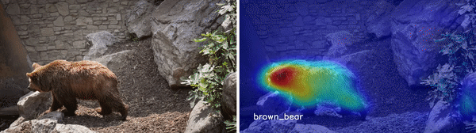
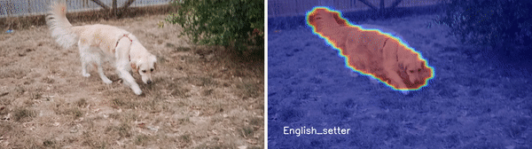
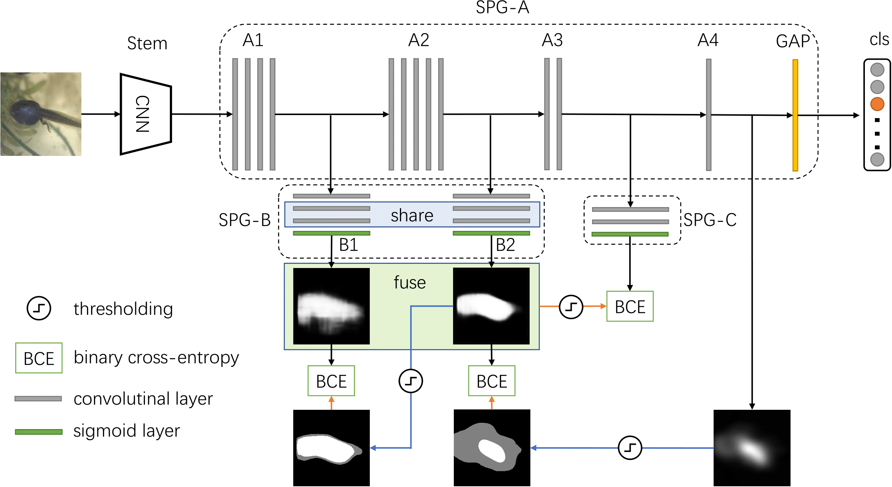
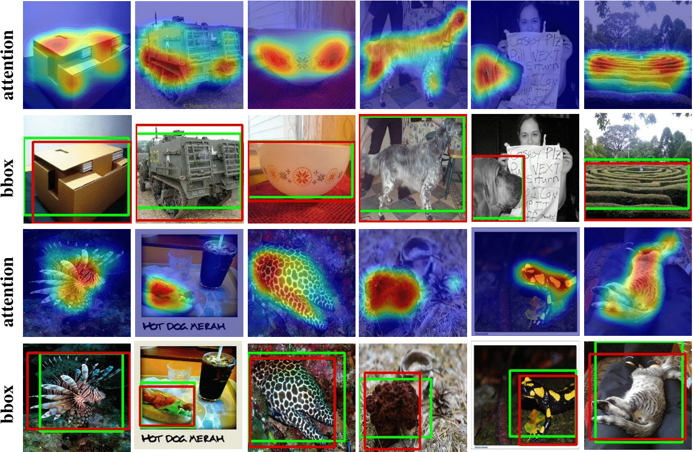
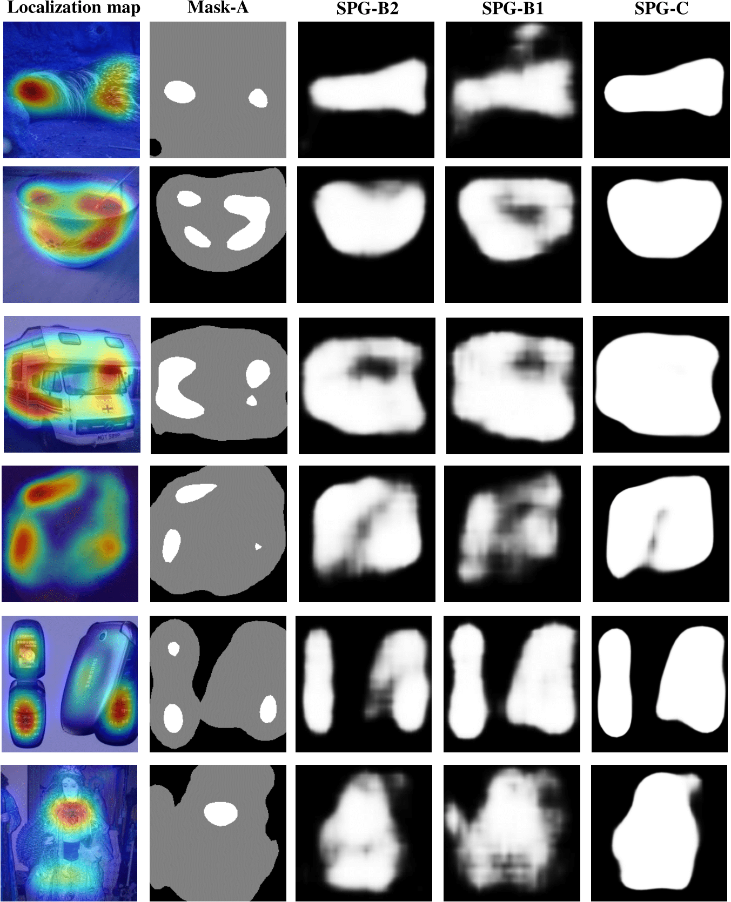

### Self-produced Guidance for Weakly-supervised Object Localization

##### Generated Object Heatmaps and Guidances


# Overview of SPG


# Train
We finetune the SPG model on the ILSVRC dataset.  
```
cd scripts
sh train_imagenet_full_v5.sh
```


# Test
 Download the pretrined model at GoogleDrive(https://drive.google.com/open?id=1EwRuqfGASarGidutnYB8rXLSuzYpEoSM (IMAGENET),https://drive.google.com/open?id=1WfrELBlEoq5WO7gKUv-MLTQ8QHY-2wiX (CUB)).

 Use the test script to generate attention maps.
```
cd scripts
sh val_imagenet_full.sh
```



# Demo
Thanks to [Jun Hao](https://scholar.google.com.sg/citations?user=8gm-CYYAAAAJ&hl=en) for providing the wonderful demos!

Please see the [setup_demo.txt](setup_demo.txt) for more guidance of setuping up the demos.

### Masks are getting better with the proposed easy-to-hard approach.


### Citation
If you find this code helpful, please consider to cite this paper:
```
@inproceedings{zhang2018self,
  title={Self-produced Guidance for Weakly-supervised Object Localization},
  author={Zhang, Xiaolin and Wei, Yunchao and Kang, Guoliang and Yang, Yi and Huang, Thomas},
  booktitle={European Conference on Computer Vision},
  year={2018},
  organization={Springer}
}
```
